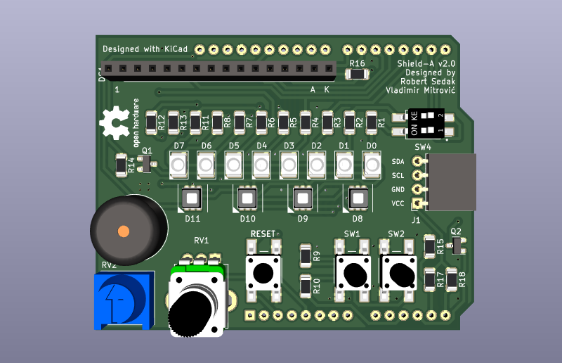
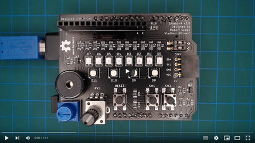

[Engleska verzija](README.md). 

Uvod
============

Shield-A v2.0 je učilo za programiranje mikropravljača Arduino Uno kompatibilno s BASCOM-AVR(C) i Arduino IDE.
Tijekom programiranja pridržavajte se sljedećih pravila:
- D0-D7 — LE diode se mogu koristiti samo kada je pin D12 postavljen u stanje OUTPUT HIGH
- LCD 1602 — se može koristiti samo ako je pin A3 postavljen u stanje OUTPUT HIGH
- RGB LE diode — su spojene u matricu (D5-D7 - boje; D8-D11 - LE diode)
- D12 — omogućuje korištenje D0-D7 LE diode
- D13 — je rezerviran za pasivnu piezo zujalicu
- A0 — je rezerviran za potenciometar
- A1,A2 — su rezervirani za tipkala u načinu rada INPUT_PULLUP
- A3 — omogućuje pozadinsko osvjetljenje za LCD 1602
- A4,A5 — su rezervirani za komunikaciju preko I2C protokola, pull-up otpornici su na pločici

Autori
------------
- Vladimir Mitrović — svojstva, prilagodba za BASCOM-AVR
- Robert Sedak — svojstva, prilagodba za Arduino, dizajn el. scheme, CAD dizajn. 

Application
-----------
Robert Sedak je snimio video s nekoliko primjera programiranim u Arduino IDE:

Primjere za Arduino IDE možete preuzati [ovdje](examples/). 
Primjeri koji završavaju na '_R' su rješenja u kojima se koristi upravljanje registrima.

Popis komponenti
-----------------
- 1 ea., PCB
- 8 ea., 8.2K ohm 1/4W 1% otpornik 1206 (R1-R8)
- 2 ea., 100 ohm 1/4W 1% otpornik 1206 (R9, R10)
- 1 ea., 2.7K ohm 1/4W 1% otpornik 1206 (R11)
- 1 ea., 1.8K ohm 1/4W 1% otpornik 1206 (R12)
- 1 ea., 3.9K ohm 1/4W 1% otpornik 1206 (R13)
- 4 ea., 10K ohm 1/4W 1% otpornik 1206 (R14, R15, R17, R18)
- 1 ea., 18 ohm 1/4W 1% otpornik 1206 (R16)
- 8 ea., LED 3528 (D0-D7)
- 4 ea., RGB LED RS-3535MWAR (D8-D11)
- 1 ea., 14x7.5mm pasivna elektronička piezoe zujalica
- 2 ea., MOSFET MMBF170 SOT-23
- 1 ea., 3386-P 10K potenciometer s gumbom
- 1 ea., RV09 10K potenciometer - dugačka osovina
- 1 ea., 2.54mm pitch DIP prekidač 2-bit
- 1 ea., 6x6x4.3mm SPST tipkalo
- 2 ea., 6x6x10mm SPST tipkalo
- 1 ea., 1x16 pin 2.54mm Pin Header
- 1 ea., 1x10 pin 2.54mm Pin Header
- 2 ea., 1x8 pin 2.54mm Pin Header
- 1 ea., 1x6 pin 2.54mm Pin Header
- 1 ea., 1x4 pin 2.54mm utičnica
- 1 ea., 1x16 pin 2.54mm utičnica
- 1 ea., LCD 1602 HD44780 (pin 15 je anoda, pin 16 katoda)

Datoteke s dizajnom
------------
Ovo učilo je dizajnirano pomoću programa [KiCad](http://kicad.org/). Datoteke se nalaze u mapi [design_files](design_files/). Elekroničku schemu možete pogledati [ovdje](images/shield-a_schematic.png).

Gerber datoteke
------------
Gerber datoteke možete preuzeti [ovdje](gerber/shield_a_v2.0.zip).

Firmware
--------
Ovo učilo može biti progrmairano pomoću [Arduino IDE](https://www.arduino.cc/) i [BASCOM-AVR(C)](https://www.mcselec.com/index.php?option=com_content&task=view&id=14&Itemid=103).
Primjeri za Arduino IDS se nalaze u mapi [examples](examples/).

Licenca
-------
[Imenovanje-Dijeli pod istim uvjetima 4.0 međunarodna (CC BY-SA 4.0)](https://creativecommons.org/licenses/by-sa/4.0/deed.hr)

Slobodno možete:
- Dijelite dalje — možete umnažati i redistribuirati materijal u bilo kojem mediju ili formatu
-  Stvarajte prerade — možete remiksirati, mijenjati i prerađivati djelo u bilo koju svrhu, pa i komercijalnu

Davatelj licence ne može opozvati slobode korištenja koje Vam je ponudio dokle god se pridržavate uvjeta licence.

Pod sljedećim uvjetima:
- Imenovanje — Morate adekvatno navesti autora, uvrstiti link na licencu i naznačiti eventualne izmjene. Možete to učiniti na bilo koji razuman način, ali ne smijete sugerirati da davatelj licence izravno podupire Vas ili Vaše korištenje djela. 
- Dijeli pod istim uvjetima — Ako remiksirate, mijenjate ili prerađujete materijal, Vaše prerade morate distribuirati pod istom licencom pod kojom je bio izvornik. 

Bez daljnjih ograničenja — Ne smijete dodavati pravne uvjete ili tehnološke mjere zaštite koji će druge pravno ograničiti da čine ono što im licenca dopušta. 

Odricanje od odgovornosti
-------------------------
NAPOMENA - Dizajn je objavljen u dobroj namjeri i "takav kakav je" ("AS IS"), te sa mogućim greškama. Autori su kreirali učilo, slike, video i programski kod. Nama je radilo i uspjelo raditi na način kako je opisano, što ne znaći da će raditi i Vama. Ne odgovaramo ni za kakve posljedice koje mogu nastati prilikom korištenja učila, uputa ili programskog koda. Odričemo sve odgovorosti i jamstva- sami ste odgovorni za ono što radite i sami ste odgovorni što ste pristali pratiti i koristiti naše upute i informacije. 

Autori mogu mijenjati specifikacije i opise proizvoda u bilo kojem trenutku, bez prethodne obavijesti. Korisnik se ne smije osloniti na odsutnost ili karakteristike bilo kojih značajki ili uputa označenih kao "rezervirano" ili "nedefinirano".
Autori zadržavaju pravo budućih izmjena definicija i neće snositi nikakvu odgovornost za sukobe ili nekompatibilnosti koje proizlaze iz budućih promjena. Podaci o proizvodu na web stranici ili materijalima podložni su promjenama bez prethodne obavijesti. Nemojte finalizirati dizajn s ovim podacima. 

Reference Designs ARE PROVIDED "AS IS" AND "WITH ALL FAULTS". Authors DISCLAIMS ALL OTHER WARRANTIES, EXPRESS OR IMPLIED, REGARDING PRODUCTS, INCLUDING BUT NOT LIMITED TO, ANY IMPLIED WARRANTIES OF MERCHANTABILITY OR FITNESS FOR A PARTICULAR PURPOSE.
Authors may make changes to specifications and product descriptions at any time, without notice. The Customer must notrely on the absence or characteristics of any features or instructions marked "reserved" or "undefined." 
Authors reservesthese for future definition and shall have no responsibility whatsoever for conflicts or incompatibilities arising from future changes to them. The product information on the Web Site or Materials is subject to change without notice. Do not finalize a design with this info.

